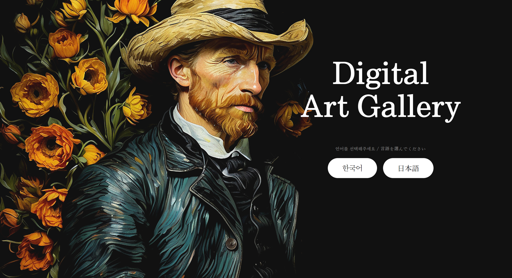
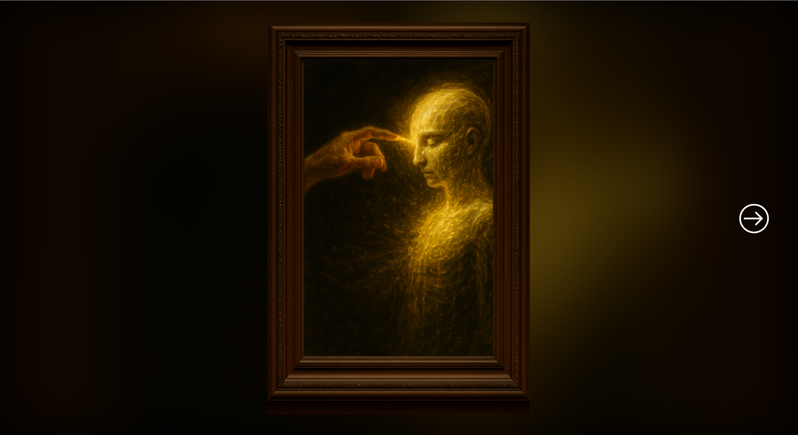
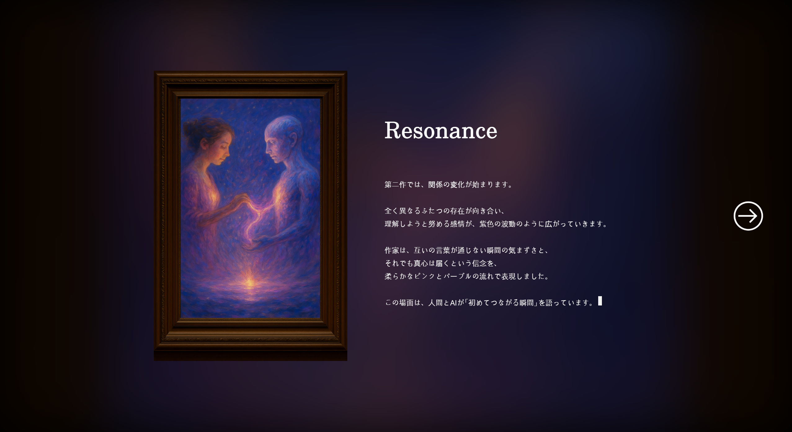
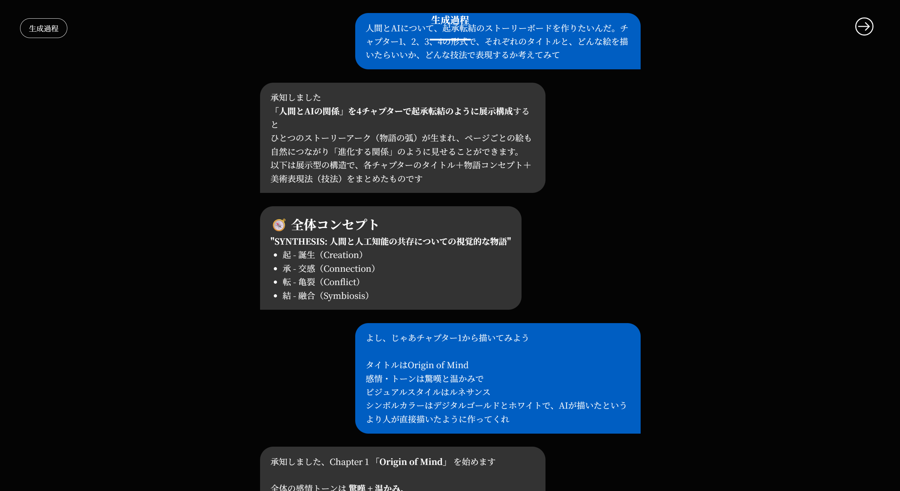

<div align="center">

# 🎨 Digital Art Gallery

**AIが語る、体験型デジタル美術館 | AI가 말하는, 체험형 디지털 미술관**


[🇯🇵 日本語 (Japanese)](#jp-japanese-version) | [🇰🇷 한국어 (Korean)](#kr-korean-version)

</div>

---

<a id="jp-japanese-version"></a>
## 🇯🇵 Japanese Version

### 📌 プロジェクト概要

AIが制作から解説まで語り手となる、一方通行の体験型デジタル美術館です。
訪問者は作品タイトルを知らない状態で4点の絵画を鑑賞し、自分なりの解釈を持った後にタイトルと解説が明かされます。
HTML / CSS / JavaScript（Vanilla）のみで実装した、バックエンドなしの完全フロントエンド作品です。

> 開発期間：2025年11月（約2週間）｜チーム：5名

---

### ✨ 主な機能

| 機能 | 実装技術 |
|------|---------|
| **タイプライター演出** | `setTimeout` 再帰 + コールバックチェーンでタイトル→本文→ボタン表示を直列制御 |
| **スクロール連動バブルアニメーション** | `IntersectionObserver API` + `unobserve()` による再実行防止とパフォーマンス最適化 |
| **10秒強制鑑賞タイマー** | 次へボタンを10秒間非表示にし、作品をじっくり見るよう誘導するUX設計 |
| **芳名録（localStorage永続化）** | 言語別ストレージ分離・入力バリデーション・リロード後もデータ保持 |
| **日韓言語切替** | `data-i18n` 属性方式で全ページ一括翻訳、日本語選択時はNoto Serif JPをCDNから動的ロード |

---

### 🗺️ ページフロー

```
index（言語選択）
  └──▶ 鑑賞方法 1 → 2 → 3 → 4 → 5
           └──▶ Gallery 1 → 2 → 3 → 4   ［10秒タイマー］
                    └──▶ Art Themes 1 → 2 → 3 → 4   ［タイプライター］
                              └──▶ AI画家紹介   ［タイプライター］
                                       └──▶ 芳名録 → イベント → 制作過程 → チーム紹介
                                                                            └──▶ index
```

---

### 🛠️ 技術スタック

| カテゴリ | 内容 |
|---------|------|
| **言語** | HTML5, CSS3, JavaScript (Vanilla ES6+) |
| **CSS技法** | Flexbox, Viewport Units, `@keyframes`, `filter: blur()`, `transition` |
| **JavaScript API** | `IntersectionObserver`, `localStorage`, `setTimeout`, `requestAnimationFrame`, DOM API |
| **外部リソース** | BookkMyungjo（jsDelivr CDN）, Noto Serif JP（Google Fonts） |
| **ツール** | Figma, VSCode + Live Server, Git / GitHub |

---

### 👥 チーム構成

| 名前 | 役割 |
|------|------|
| **ユン・ビョンジン（チームリーダー）** | 展覧会全体企画 · AI画像制作 · ギャラリー · 作品解説 · 画家紹介ページ開発 |
| キム・ジンソン | Figmaデザイン · ホーム · チーム紹介ページ開発 |
| オ・ガンソク | Figmaデザイン · 鑑賞方法 · イベントページ開発 |
| チョン・ミンシク | Figmaデザイン · 芳名録ページ開発 |
| ハム・ジュンウ | AI画像制作補助 · 画像生成過程ページ開発 |

---

### 🔧 担当機能の詳細（ユン・ビョンジン）

**① gallery1〜4** — 10秒強制鑑賞タイマー
```js
setTimeout(() => { nextBtn.classList.add('active'); }, 10000);
```
訪問者が作品の前に立ち止まる体験を再現するためのUX設計。

**② art_themes1〜4** — タイプライター + コールバックチェーン
```js
typeWriter("title", titleText, 140, () => {
    typeWriter("typewriter", bodyText, 70, () => { /* ボタン表示 */ });
});
```
タイトル完了後に本文開始、本文完了後にボタン表示という演出順序をコールバックで直列制御。

**③ artist_introduction** — AI画家の自己紹介タイプライター
AIが一人称で語る文体で、人工知能の視点から展覧会を紹介。

**④ js/utils.js** — typeWriter関数の共通化リファクタリング
5つのJSファイルに重複していた関数を1つに集約し、75行を削除。

---

### 📸 スクリーンショット

| 言語選択画面 | ギャラリー画面 |
|:-----------:|:-------------:|
|  |  |

| 作品解説画面（タイプライター） | 制作過程画面（バブルアニメーション） |
|:-----------------------------:|:-----------------------------------:|
|  |  |

---

<a id="kr-korean-version"></a>
## 🇰🇷 Korean Version

### 📌 프로젝트 소개

AI가 기획부터 해설까지 직접 이야기하는 일방향 체험형 디지털 미술관입니다.
관람객은 작품 제목을 모른 채 4점의 그림을 감상하고, 자신만의 해석을 가진 뒤 제목과 해설이 공개됩니다.
HTML / CSS / JavaScript(Vanilla)만으로 구현한 백엔드 없는 순수 프론트엔드 작품입니다.

> 개발 기간: 2025년 11월 (약 2주) | 팀 구성: 5명

---

### ✨ 주요 기능

| 기능 | 구현 기술 |
|------|---------|
| **타이프라이터 연출** | `setTimeout` 재귀 + 콜백 체인으로 제목→본문→버튼 표시를 직렬 제어 |
| **스크롤 연동 버블 애니메이션** | `IntersectionObserver API` + `unobserve()`로 재실행 방지 및 성능 최적화 |
| **10초 강제 감상 타이머** | 다음 버튼을 10초간 숨겨 작품을 충분히 감상하도록 유도하는 UX 설계 |
| **방명록 (localStorage 영속화)** | 언어별 저장소 분리 · 입력 유효성 검사 · 새로고침 후에도 데이터 유지 |
| **한/일 언어 전환** | `data-i18n` 속성 방식으로 전 페이지 일괄 번역, 일본어 선택 시 Noto Serif JP 동적 로드 |

---

### 🗺️ 페이지 흐름

```
index（언어 선택）
  └──▶ 관람 방법 1 → 2 → 3 → 4 → 5
           └──▶ Gallery 1 → 2 → 3 → 4   ［10초 타이머］
                    └──▶ Art Themes 1 → 2 → 3 → 4   ［타이프라이터］
                              └──▶ AI 화가 소개   ［타이프라이터］
                                       └──▶ 방명록 → 이벤트 → 생성 과정 → 팀 소개
                                                                         └──▶ index
```

---

### 🛠️ 기술 스택

| 카테고리 | 내용 |
|---------|------|
| **언어** | HTML5, CSS3, JavaScript (Vanilla ES6+) |
| **CSS 기법** | Flexbox, Viewport Units, `@keyframes`, `filter: blur()`, `transition` |
| **JavaScript API** | `IntersectionObserver`, `localStorage`, `setTimeout`, `requestAnimationFrame`, DOM API |
| **외부 리소스** | BookkMyungjo (jsDelivr CDN), Noto Serif JP (Google Fonts) |
| **도구** | Figma, VSCode + Live Server, Git / GitHub |

---

### 👥 팀 구성 및 역할

| 이름 | 역할 |
|------|------|
| **윤병진 (조장)** | 전시 전체 기획 · AI 이미지 제작 · 갤러리 · 작품 해설 · 화가 소개 페이지 개발 |
| 김진선 | Figma 디자인 · 홈 · 팀 소개 페이지 개발 |
| 오강석 | Figma 디자인 · 관람 방법 · 이벤트 페이지 개발 |
| 전민식 | Figma 디자인 · 방명록 페이지 개발 |
| 함준우 | AI 이미지 제작 보조 · 생성 과정 페이지 개발 |

---

### 🔧 담당 기능 상세 (윤병진)

**① gallery1~4** — 10초 강제 감상 타이머
```js
setTimeout(() => { nextBtn.classList.add('active'); }, 10000);
```
관람객이 작품 앞에 머무르는 경험을 재현하기 위한 UX 설계.

**② art_themes1~4** — 타이프라이터 + 콜백 체인
```js
typeWriter("title", titleText, 140, () => {
    typeWriter("typewriter", bodyText, 70, () => { /* 버튼 등장 */ });
});
```
제목 완료 후 본문 시작, 본문 완료 후 버튼 표시 순서를 콜백으로 직렬 제어.

**③ artist_introduction** — AI 화가 자기소개 타이프라이터
AI가 1인칭으로 말하는 문체로, 인공지능 시점에서 전시를 소개.

**④ js/utils.js** — typeWriter 함수 공통화 리팩토링
5개 JS 파일에 중복된 함수를 1개 파일에 통합하여 75줄 제거.

---

### 📸 스크린샷

| 언어 선택 화면 | 갤러리 화면 |
|:-------------:|:-----------:|
|  |  |

| 작품 해설 화면 (타이프라이터) | 생성 과정 화면 (버블 애니메이션) |
|:---------------------------:|:-------------------------------:|
|  |  |

---

<div align="center">

© 2025 Digital Art Gallery Team

</div>
